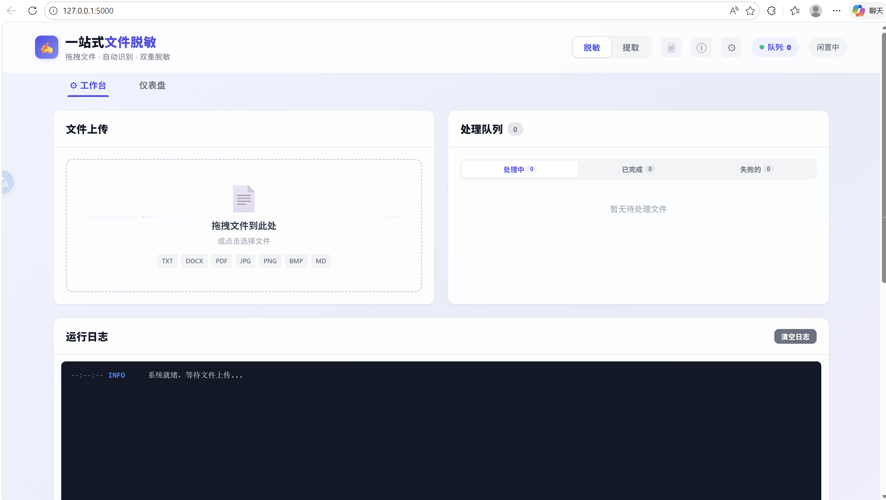
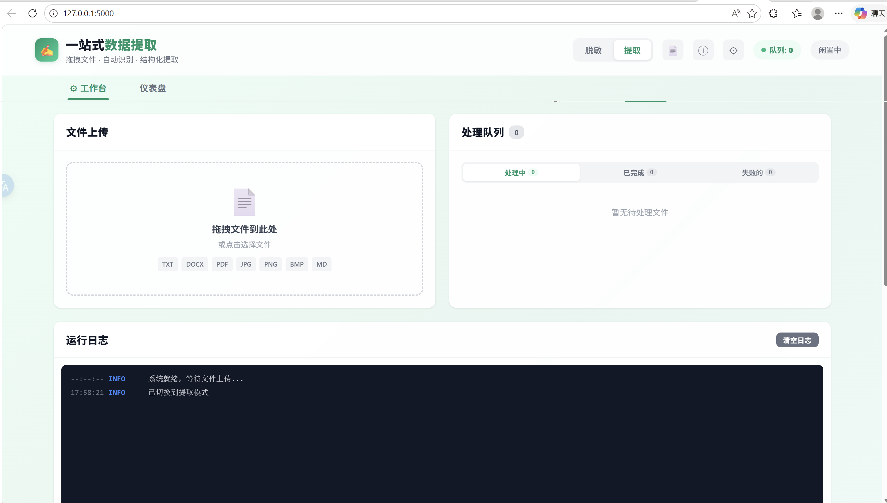
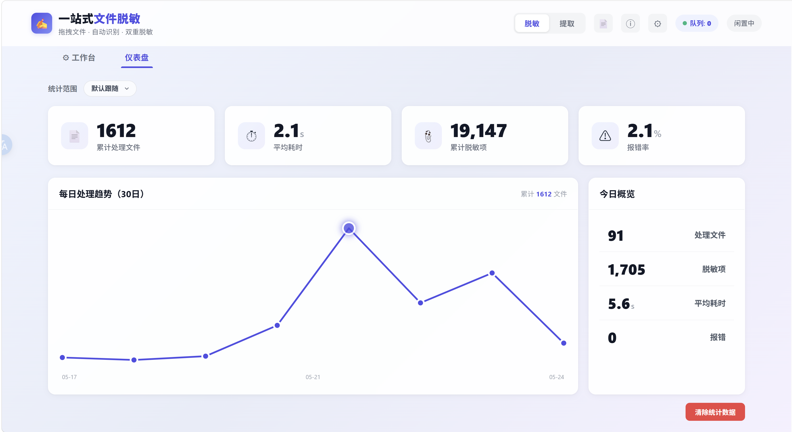

# 一站式文件处理工具

> 本地运行 · 隐私优先 · 正则 + 大模型双引擎脱敏 · 结构化数据提取

一个基于本地大模型的**文件脱敏**与**数据提取**工具。上传文件后自动识别并替换敏感信息（身份证、手机号、金额、日期等 36 类），或按自定义模板提取结构化数据汇入 Excel 合成表。

***

## 界面预览





***

## 核心功能

### 文件脱敏

- 支持 **TXT / DOCX / PDF / 图片** 上传，自动识别并替换敏感信息
- **36 条正则规则**，覆盖 22 类全字段 + 14 类数字子类型：

| 类别                      | 示例                                 |
| ----------------------- | ---------------------------------- |
| 邮箱                      | `user@example.com`                 |
| 手机号 / 座机号               | `13800138000` / `010-88880001`     |
| 身份证号                    | `310105199108124321`               |
| 银行卡号                    | `6228480038123456701`              |
| 统一社会信用代码                | `91110108MA01ABCD1E`               |
| IPv4 / URL              | `192.168.1.1` / `https://...`      |
| 日期 (完整/年月/年/天数)         | `2024年3月15日` / `2024年3月` / `2024年` |
| 金额 (普通/大额/小数万)          | `¥500,000.00` / `8000万`            |
| 数量 / 数量中文 / 范围          | `500万条` / `三十二个` / `200-500`       |
| 时间 (月数/年数/小时/期限)        | `3个月` / `2周`                       |
| 百分比 / 中文百分比             | `99.5%` / `百分之五十`                  |
| 中文大写金额                  | `柒拾万元整`                            |
| 标签类 (人名/公司/地址/银行/编号/产品) | `法定代表人：张三`                         |

- **三层深度策略**：
  - `quick` — 仅正则匹配，毫秒级，适合快速初筛
  - `standard` — 正则 + 一次大模型补漏（**推荐**）
  - `deep` — 正则 + 两轮大模型审查，最大程度防漏
- 实体传播 + 结构词白名单，智能处理合同等重复引用场景
- 结果三栏展示：原文对照 · 脱敏预览 · 替换详情表
- 支持在线编辑脱敏结果并保存

### 数据提取

上传票据后，LLM 自动识别并结构化输出到 Excel 合成表，支持自定义模板、在线编辑、自动校验和多轮积累。

#### 提取流程

```
上传票据 (TXT/DOCX/PDF/图片)
  → 文本解析
  → 按模板字段向 LLM 请求结构化提取
  → JSON 解析 → 抬头字段 + 明细行
  → 自动汇入 Excel 合成表（追加或新建 Sheet）
  → 发票自检验（如有）
  → 在线编辑 / 导出
```

#### 预设模板

| 模板          | 抬头字段                                          | 明细字段                        |
| ----------- | --------------------------------------------- | --------------------------- |
| **发票信息提取**  | 发票号码、开票日期、买方名称、买方税号、卖方名称、卖方税号、金额合计、税率、税额合计、备注 | 货物/服务名称、规格型号、数量、单价、金额、税率、税额 |
| **送货单信息提取** | 送货单号、送货日期、收货方名称、收货方地址、发货方名称、发货方地址、总数量、总金额     | 货品名称、规格、数量、单价、金额、备注         |

#### 自定义模板

- **方案管理**：新建/编辑/删除/重命名提取模板，切换模板后自动清空合成表加载新数据
- **模板字段**：自由定义抬头字段（文本/数字/日期类型）和明细字段
- **方案保存**：模板定义持久化为 JSON，支持多方案一键切换

#### Excel 合成表

- 提取结果自动追加到合成表，相同文件重复提取时去重判断
- **多 Sheet 管理**：新建/重命名/删除/切换工作 Sheet，不同来源数据分类存放
- 单元格在线编辑，修改即保存（自动 600ms 防抖上传）
- 新增行、删除选中行、全选/取消全选
- 列宽可拖拽调整，悬浮头行固定
- 数据翻页（每页 50 行），支持页面跳转

#### 发票自检验

基于 Python `decimal` 的高精度计算引擎，逐行校验：

| 校验项   | 规则                 | 不符时           |
| ----- | ------------------ | ------------- |
| 行金额校验 | `数量 × 单价` vs 填写的金额 | 标红差异行         |
| 行税额校验 | `金额 × 税率` vs 填写的税额 | 标红差异行         |
| 汇总校验  | 总金额 vs 各行金额之和      | 标红合计行         |
| 一键检验  | 点击"自检验"按钮          | 逐行标红 + 底部汇总结果 |

#### 导入/导出

- **导出**：当前 Sheet 导出为 XLSX，保持列宽和标红格式
- **导入 XLSX**：支持合并导入外部 Excel 数据到合成表
- **导入 CSV**：自动识别分隔符和编码
- **筛选导出**：可按列筛选后仅导出可见行
- 合成表 Sheet 可单独下载、跨 Sheet 追加合并

### 通用特性

- 拖拽上传，自动处理队列（上限 100 任务）
- 暂停 / 恢复 / 终止，灵活的队列控制
- 批量重试 / 批量取消 / 批量删除失败任务
- 大文件自动拆分（PDF ≥ 5 页 / 文本 ≥ 5000 字），分片并行处理
- SSE 实时日志与进度推送
- 仪表盘：按脱敏/提取分别统计处理量、耗时、报错率、30 日趋势图
- 多 LLM 配置方案（本地/云端）保存与一键切换
- 处理历史记录，可回溯查看

***

## 快速开始

### 环境要求

- Python 3.10+
- 一个运行中的 LLM 服务（LM Studio / Ollama / OpenAI 兼容 API）

### 获取项目

```bash
# 方式一：通过 Git 克隆
git clone https://github.com/ha123-png/file_processing_tool.git
cd file_processing_tool

# 方式二：直接下载 ZIP
# 点击 GitHub 页面绿色 "Code" 按钮 → Download ZIP → 解压后进入文件夹
```

### 安装与启动

```bash
pip install -r requirements.txt
cp config.example.json config.json
# 编辑 config.json，填入 LLM 服务地址和模型名称
python main.py
```

浏览器打开 `http://127.0.0.1:5000`。

### 配置 LLM 服务

#### LM Studio（推荐本地方案）

1. 下载安装 [LM Studio](https://lmstudio.ai/)
2. 下载多模态模型（如 Qwen2-VL、LLaVA）
3. 启动 Local Server，默认端口 1234
4. 编辑 `config.json`：

```json
{
  "llm": {
    "provider": "lm_studio",
    "base_url": "http://127.0.0.1:1234/v1",
    "api_key": "",
    "model": "qwen/qwen3-v1-8b",
    "temperature": 0.1,
    "max_tokens": 4096
  }
}
```

#### Ollama

```bash
ollama pull llama3.2-vision
```

配置：`base_url` 为 `http://localhost:11434/v1`，`api_key` 留空。

#### OpenAI / 其他兼容 API

填写对应服务商的 `base_url` 和 `api_key`。切换云端 API 时会弹出安全确认提示。

***

## 项目结构

```
├── main.py                     # 应用入口
├── config.example.json         # 配置模板（复制为 config.json 后填写）
├── requirements.txt            # Python 依赖
├── pytest.ini                  # Pytest 配置
│
├── app/
│   ├── routes.py               # Flask 路由（40+ API + SSE 推送）
│   ├── processor.py            # 处理引擎（脱敏/提取编排，含 expand_digits）
│   ├── regex_rules.py          # 36 条正则规则 + 空格归一化 + 歧义标记
│   ├── llm_client.py           # LLM API 客户端（支持流式响应）
│   ├── queue_manager.py        # 任务队列调度（暂停/恢复/取消）
│   ├── task_store.py           # 任务持久化存储（SQLite）
│   ├── file_handler.py         # 文件读取与编码检测
│   ├── splitter.py             # 大文件拆分（PDF 按页 / 文本按长度）
│   ├── excel_manager.py        # Excel 合成表管理
│   ├── invoice_validator.py    # 发票自检验（Decimal 精度计算）
│   ├── stats_db.py             # 仪表盘统计数据（SQLite）
│   └── shared.py               # 全局状态 / 配置 / SSE / 日志
│
├── templates/
│   └── index.html              # 前端单页应用
│
├── static/
│   ├── style.css               # 全局样式（1867 行）
│   └── js/
│       ├── app.js              # 核心逻辑（队列/结果/SSE/下载/历史）
│       ├── extract.js          # 提取与 Excel 合成表交互
│       ├── settings.js         # 设置面板与方案管理
│       └── dashboard.js        # 仪表盘统计可视化
│
├── docs/
│   └── images/                 # README 截图
│
├── tests/                      # 测试套件（290+ 条后端 + 58 条前端）
│   ├── playwright/             # Playwright 浏览器端到端测试
│   ├── test_regex_rules.py     # 正则规则单元测试
│   ├── test_processor.py       # 处理器测试
│   ├── test_api.py             # API 路由测试
│   └── ...
```

***

## 运行测试

```bash
# 后端全量测试（290 条，无需 LLM 运行）
pytest tests/ --ignore=tests/playwright -v

# 前端浏览器测试（需启动服务器 + playwright 安装）
pytest tests/playwright/ -v

# 全量
pytest tests/ -v
```

***

## 技术栈

| 层      | 技术                                           |
| ------ | -------------------------------------------- |
| Web 框架 | Flask                                        |
| 前端     | 原生 HTML / CSS / JavaScript（无框架依赖）            |
| LLM 集成 | OpenAI 兼容 API（支持 SSE 流式）                     |
| 文档解析   | python-docx (Word)、PyMuPDF (PDF)、Pillow (图片) |
| Excel  | openpyxl                                     |
| 数据库    | SQLite（标准库）                                  |
| 实时通信   | Server-Sent Events                           |
| 测试     | pytest + pytest-flask + Playwright           |

***

## 配置说明

`config.json` 主要配置项：

| 配置段               | 说明                                                   |
| ----------------- | ---------------------------------------------------- |
| `llm`             | LLM 服务连接（provider / base\_url / model / temperature） |
| `llm_profiles`    | 多方案配置列表，前端可一键切换                                      |
| `desensitization` | 占位符 / 默认深度 / 大模型跳过正则项                                |
| `server`          | 主机 / 端口 / debug 模式                                   |
| `limits`          | 文件大小上限 / 队列容量 / 大文件拆分阈值                              |

> `config.json` 包含敏感信息，已被 `.gitignore` 排除，不会提交到仓库。

***

## 处理流程

### 脱敏

```
上传文件
  → 文件类型检测 & 编码识别
  → 大文件自动拆分（如需要）
  → 空格归一化（normalize_spaced_numbers）
  → 正则匹配（36 条规则，双模式：全字段 + 数字子类型）
  → LLM 大模型补漏（standard/deep 模式）
  → 去重 + 扩展相邻数字（仅金额/数量类别）
  → 按长度降序替换（先换长串防止短串误伤）
  → 输出脱敏文件 + 替换详情报告
```

### 提取

```
上传文件
  → 文本解析
  → 匹配预设或自定义模板字段
  → LLM 结构化提取（JSON 输出）
  → 发票自检验（数量×单价 vs 金额 vs 税额）
  → 汇入 Excel 合成表（追加行或新建 Sheet）
```

***

## 局限性

- 使用 Flask 开发服务器，**不适合高并发生产环境**。多人使用建议替换为 gunicorn/waitress
- 脱敏效果依赖大模型质量，建议使用多模态模型以获得最佳图片/PDF 识别效果
- 超长文档（> 100 页 PDF）处理时间较长，建议分批
- 当前无用户认证机制，仅适合本机或可信局域网内使用
- 前端为原生 JS 单页应用，未使用 React/Vue 等框架

***

## License

MIT License
